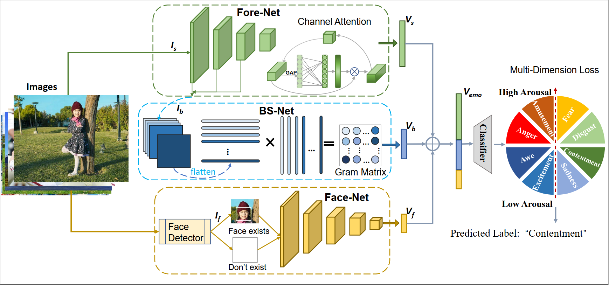

# Multi-Dimension Full Scene Integrated Visual Emotion Analysis Network  

The Pytorch implementation of “Multi-Dimension Full Scene Integrated Visual Emotion Analysis Network”.

This is a preprint version for  2024 ICME.

## Requirements 

- Python
- torch
- torchvison
- pandas
- opencv
- seaborn
- numpy
- matplotlib

## Usage

All the code is in the folder ‘src’, you just need to run the `main.py`  file, in between you need to replace your model, data set and so on the correct path. Run it.
Our pretrained model is coming soon.

